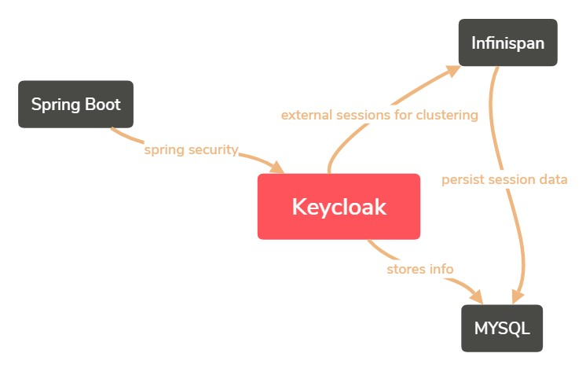

# Keycloak-infinispan cluster

Are you turning nuts configuring KC on K8s?
Do you need to persist de KC session in an external service for Infinispan?
Do you want to save data on a DB to make it bulletproof?

This project includes a basic configuration with KC 17 and infinispan
KC Persistance and Infinispan persistence relies on msyql 5.7

To start the project:

> docker-compose up -d --build

Infinispan 1, will be available at:
http://localhost:11222/
u:user
p:pass
> Checked that all KC cache repositories are created

Keycloak 1, will be available at:
http://localhost:8180/auth
u:admin
p:admin
> Check that basic realm is generated (test realm)
> Check that user test exist in realm (test/test - test@test.com)

Realm file located at keycloak/realm.json

## Application to connect

Under /app-springboot you have a spring boot application that needs it´s own realm
The project needs JDK11 to be launched and is not included in the docker-compose

